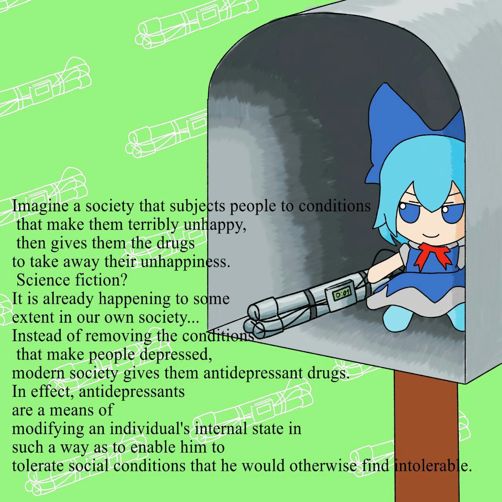

# Супер крутое приложение от меня (ВСЕ меня знают :anger:)
### Зачем оно нужно? :speech_balloon:
Чтобы подарить предыдущим **крутым** скриптам **крутой** интерфейс, конечно.

Можно делить на годы, месяцы и на x и y, а ещё искать значение по дате и всё с помощью **крутого** интерфейса.
### Версия python и на чём тестировалось :japanese_goblin:
python 3.11.3

Windows 10 x64
### Бака :snowflake:

###
